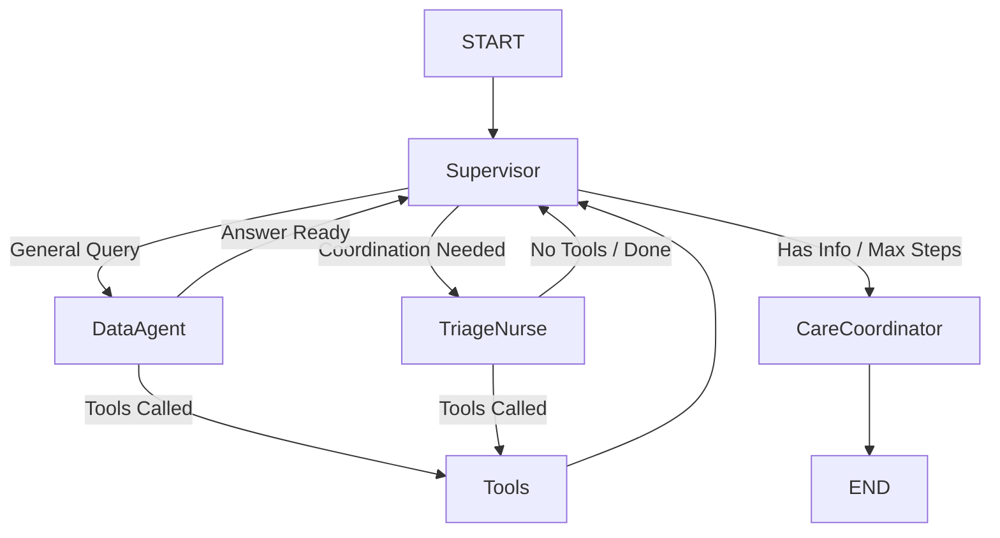

# Healthcare Care Coordinator Agent

## 1. Overview
The **Healthcare Agent** is a specialized LangGraph agent designed to act as a Care Coordinator. It triages patient requests, verifies insurance coverage, checks medical policies (e.g., for imaging pre-authorization), and synthesizes care plans.

It operates on a **Supervisor-Worker** pattern where a Supervisor node routes work between a Triage Nurse (who gathers data via tools) and a Care Coordinator (who drafts the final response).

## 2. Architecture

### 2.1 Graph Structure
The agent is implemented as a `StateGraph` with the following nodes:

1.  **Supervisor**: The entry point. It analyzes the conversation state and tool outputs to decide the next step:
    *   **Data Agent** (`general` task): For simple queries (patient summaries, allergies, policy checks) without coordination needs.
    *   **Triage Nurse** (`coordination` task): For complex requests requiring multiple steps, scheduling, or care planning.
    *   **Care Coordinator**: Synthesizes the final plan after triage.

2.  **Data Agent**: An "Information Assistant" focused on direct answers. It calls tools and returns the raw data or a concise summary directly to the user.

3.  **Triage Nurse**: Focused on gathering detailed context for care planning. It determines which tools to call for complex workflows.

4.  **Tools**: Executes the actual Python functions associated with the selected tools.

5.  **Care Coordinator**: The synthesizer. It takes gathered structured data and drafts a formal 3-paragraph Care Plan.

### 2.2 Agent Graph Diagram

## 3. Data Sources

### 3.1 Mock Database
The agent uses file-based mock databases located in `data/mock_db/`:
-   `patients.json`: Patient records, standardizing IDs like `PT-12345` to `John Doe`.
-   `appointments.json`: Mock slots for cardiology, primary care, etc.
-   `medications.json`: Standard drug info.

### 3.2 Policy Engine
Clinical policies are stored as Markdown files in `data/policies/`. The `policy_check` tool uses a two-step process:
1.  **retrieval**: Scans `README.md` in the policy dir to find relevant files.
2.  **evaluation**: Reads the specific policy file (e.g., `imaging_policy.md`) and uses an LLM to compare the patient's data against the requirements.

## 4. Validation & Testing
We validate the agent using a suite of 20 test queries covering all capabilities.

### Validation Run Logs
See [Query Walkthrough](query_walkthrough.md) for detailed results and screenshots from the latest run (Queries 1-6).
