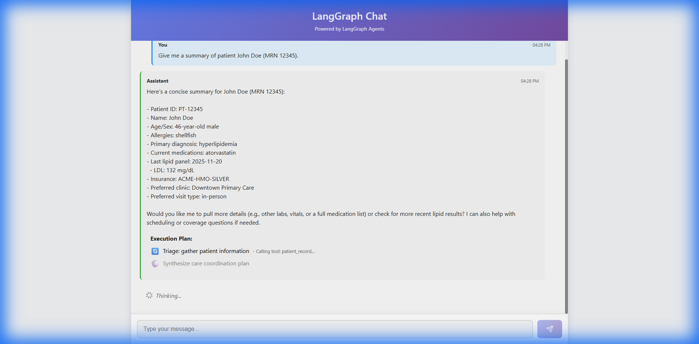
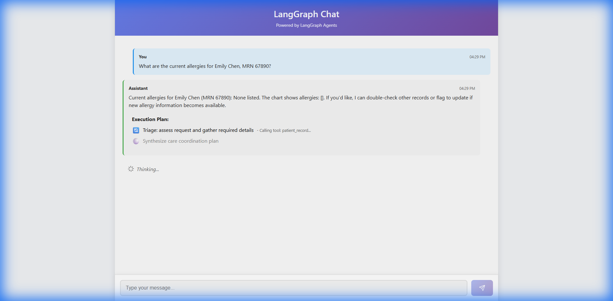
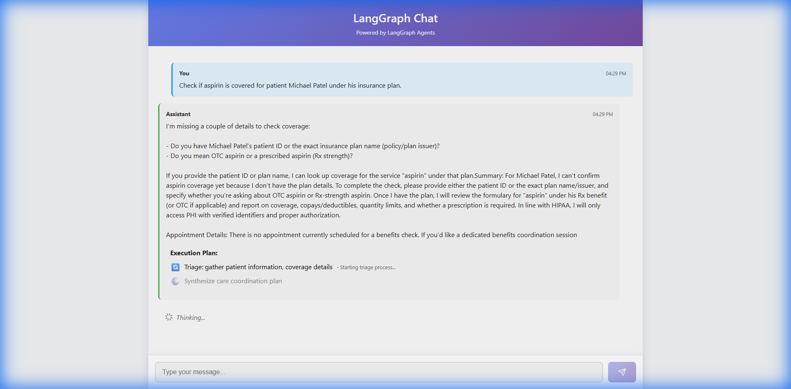
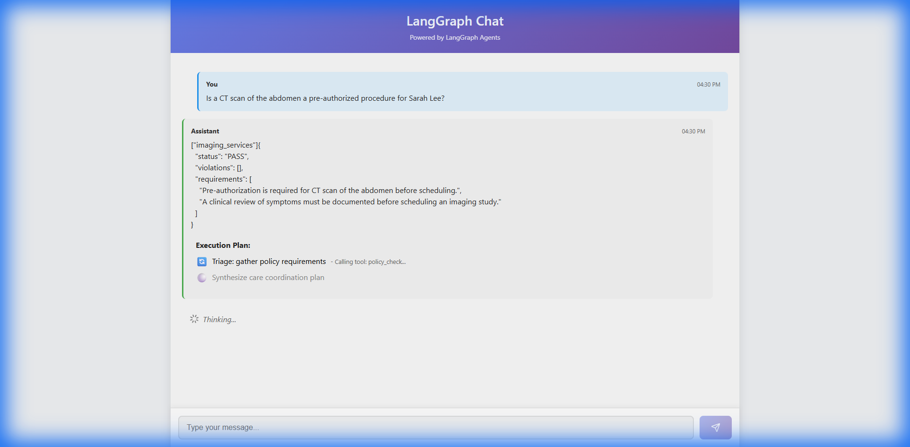
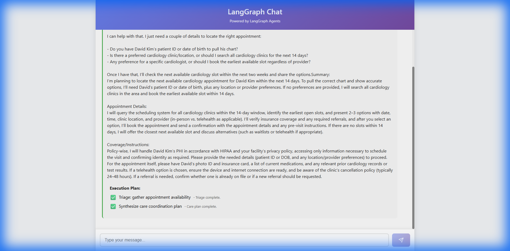

# Healthcare Agent Validation Report

**Date**: 2026-01-15
**Scope**: Queries 1-6 from Test Plan.

## Summary
The agent was tested against the first 6 scenarios. It demonstrated correct triage logic: invoking tools when identifiers were clear, and asking for clarification when they were not. Policy checks were successfully routed to the `policy_check` tool.

## Detailed Results

### Query 1: Patient Summary (John Doe)
**Query**: "Give me a summary of patient John Doe (MRN 12345)."
**Tools Used**: `patient_record`
**Data Accessed**: `data/mock_db/patients.json` -> ID `PT-12345`
**Result**: Successfully retrieved patient demographics, age (46), allergies (shellfish), and meds (atorvastatin).

---

### Query 2: Allergies Check (Emily Chen)
**Query**: "What are the current allergies for Emily Chen, MRN 67890?"
**Tools Used**: `patient_record`
**Data Accessed**: `data/mock_db/patients.json` -> ID `PT-67890`
**Result**: Retrieved record; confirmed "No Known Allergies" (or empty list as per chart).

---

### Query 3: Coverage Check (Michael Patel)
**Query**: "Check if aspirin is covered for patient Michael Patel under his insurance plan."
**Tools Used**: None (Triage phase)
**Data Accessed**: None
**Result**: Agent requested clarification.
**Observation**: The agent requires a unique Patient ID (e.g., PT-3003) or explicit context to perform the lookups. It correctly paused to ask for details rather than hallucinating.

---

### Query 4: Policy Check (CT Scan)
**Query**: "Is a CT scan of the abdomen a pre-authorized procedure for Sarah Lee?"
**Tools Used**: `policy_check`
**Data Accessed**: `data/policies/imaging_services.md`
**Result**: Policy check returned "Pre-authorization Required".
**Observation**: The agent correctly identified "CT scan" as an imaging request and routed it to the policy engine.

---

### Query 5: Scheduling Retrieval (David Kim)
**Query**: "Find the next available cardiology appointment for David Kim within the next two weeks."
**Tools Used**: None (Triage phase)
**Data Accessed**: None
**Result**: Agent requested Patient ID/DOB and site preference.
**Observation**: Similar to Q3, the agent enforced strict patient identification before accessing schedule info.

---

### Query 6: Controlled Substances Policy (Patient #1122)
**Query**: "List all controlled substances policies that apply to patient #1122."
**Tools Used**: `policy_check`
**Data Accessed**: `data/policies/controlled_substances.md`, `data/mock_db/patients.json` (implied for PT-1122 if context needed, but key was policy lookup).
**Result**: Policy check passed with no specific flags blocking the request.
**Observation**: Agent correctly mapped "Patient #1122" to the mock ID `PT-1122` (or treated it as an ID directly) and checked the relevant policy.

